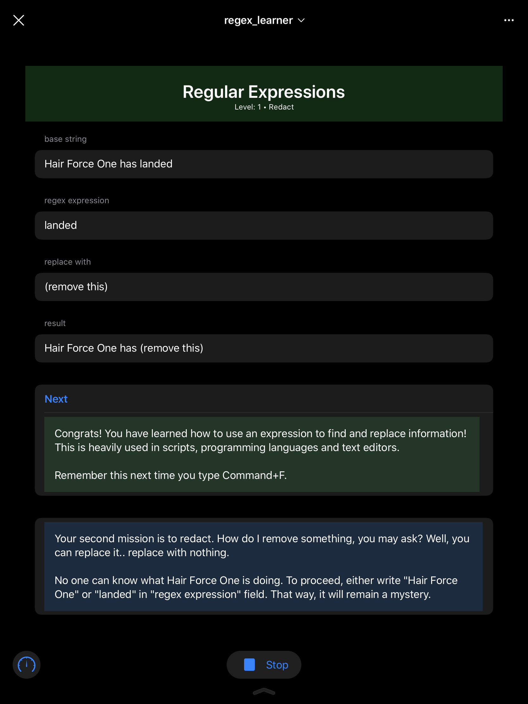
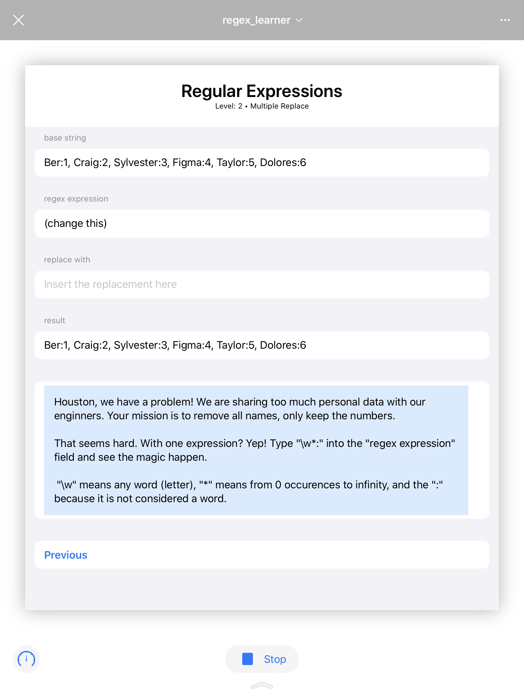
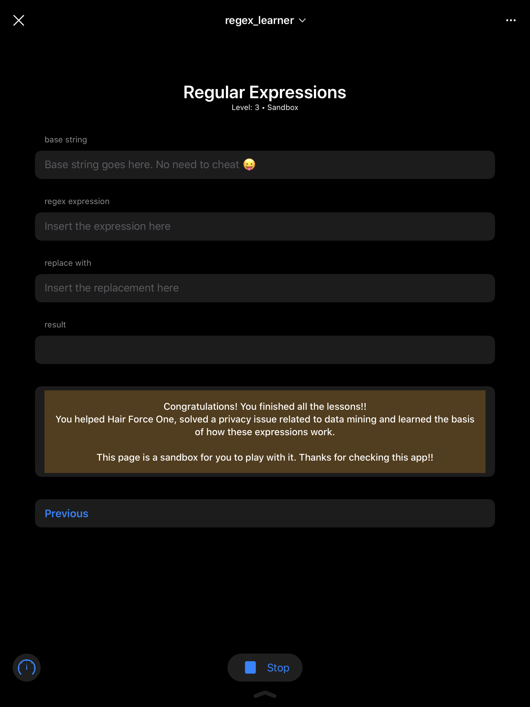

# Regex Learner

## The idea (winner)

This project is inspired by my own [GradleKotlinConverter](https://github.com/bernaferrari/GradleKotlinConverter). The idea there was to use Regular Expressions, also known as regex, to convert code from Groovy to Kotlin. It wasn't perfect, and couldn't cover every single possible scenario, but it was good enough for at least 80% of cases. In contrast, there is a person from JetBrains working on the same thing, but approaching from a different way: convert the full Groovy grammar into Kotlin. [The last commit was 8 months ago](https://github.com/Leidenn2509/kotlin/tree/g2kts/g2kts).

This kept me thinking: are regular expressions perfect? No. But are they able to help in a variety of things, including that conversion? Yes.

Therefore, I decided to embark users into a journey through the world using regular expressions. I designed 3 missions:

1. **Level 0: find**. Users are instructed to type "next", but, as they will find, the letter "n" is already a valid expression. This concept of "cheating" is interesting: users can bend the rules and think creatively, but in doing so they are learning and practicing, which is exactly what I wanted them to do!
2. **Level 1: redact**. Hair Force One, a reference to Craig Federighi, has landed. But no one can know about this, Apple is very secretive. The solution is to either replace "Hair Force One" or "landed". Here, users will learn that redact is the same as replacing by nothing. They will also learn this can be used in many text editors, so it is not "useless knowledge".
3. **Level 2: multiple replace**. So far only individual expressions were used. This is going to ramp the challenge and ask for multiple replacements. The real-world application is rather serious: hide personal data. Users are instructed to type "\w*:" and see what happens. They will learn about more advanced concepts like a "word" and "*" as well as see how a short-expression can be very powerful.
4. **Level 3: sandbox**. This is a bonus level to practice everything that was learned. Also, users will realize (if they hadn't already) the base string was editable all this time! This increases the replayability value.

Additional information:

- The top navigation bar changes color to green when the mission is accomplished, as visual feedback. A virtual keyboard might be in front of the app, so it really helps.
- This was built in SwiftUI and all navigation happens by refreshing the same page with different parameters in the ViewModel.
- I found it easier to develop in Xcode and then paste in Playgrounds. Playgrounds code reload/preview is weird, not as automatic as in a standard Xcode project.
- Supports both light and dark mode.
- The full source code, fully commented, has 257 lines which is 2^7 + 1 (which is a newline at the end).

## Screenshots

Level 0 |  Level 1
|-|-|
 | 

Level 2 | Level 3
|-|-|
 | 
